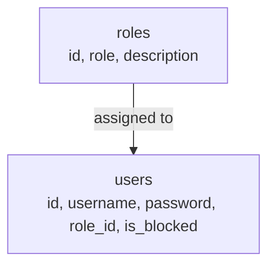
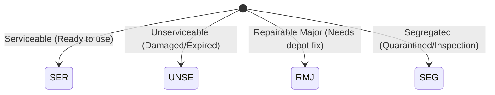
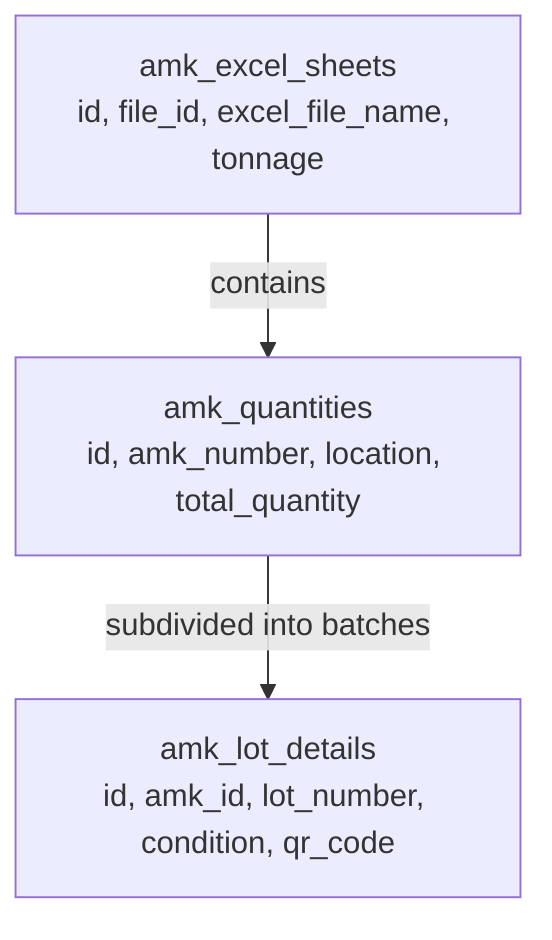
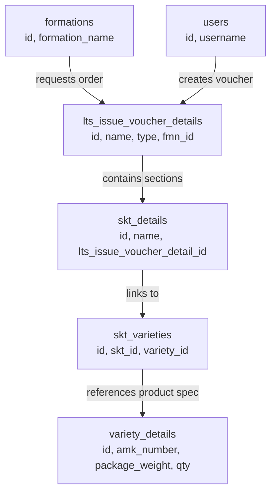
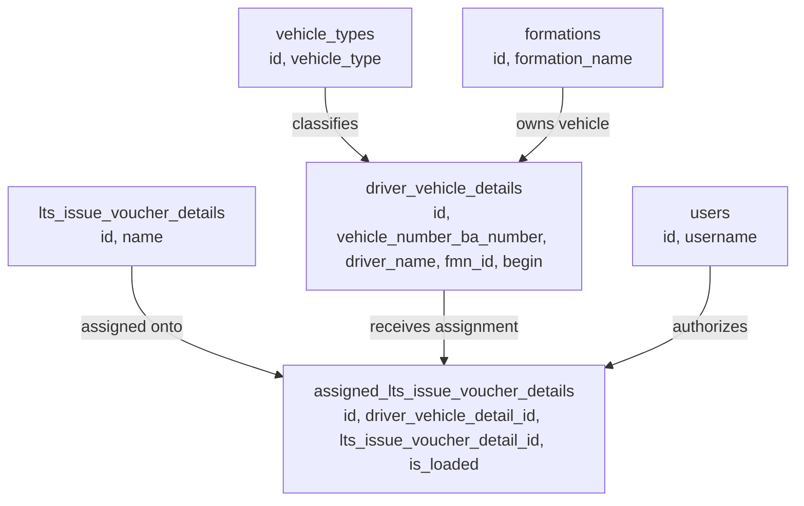
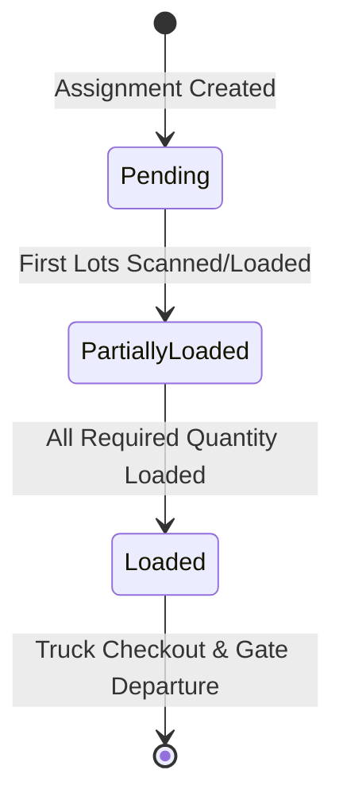
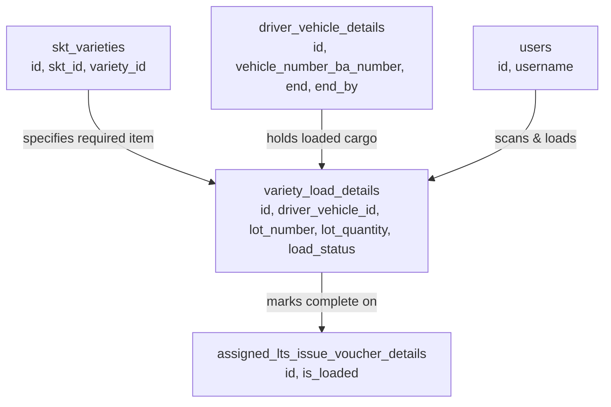
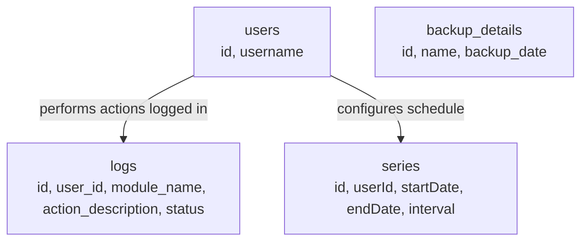
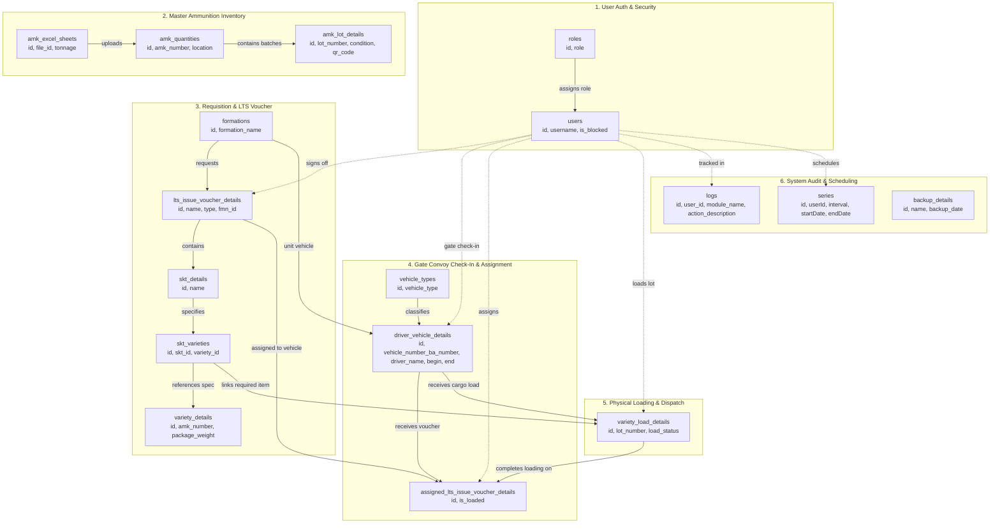
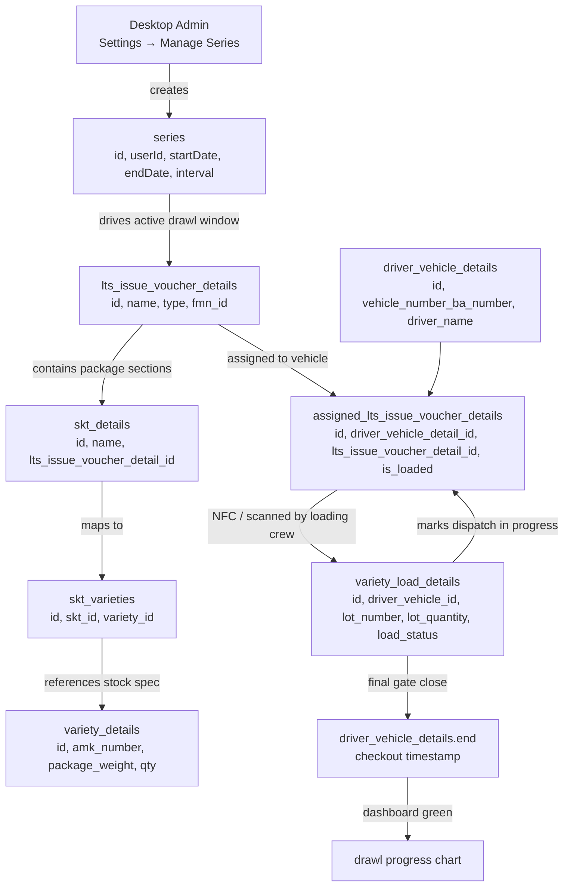

Here is the complete business analysis, plain-English translation, and visual architecture flowcharts for your database schema.

---

## 1. What Is This Project? (One-Paragraph Summary)

This project is a **Depot & Ammunition Dispatch Management System (DMS)** for defense/logistics operations. Think of it like an ultra-secure warehouse dispatch center where large crates of ammunition stock are inventoried from master spreadsheets, organized into specific batches, and assigned to delivery trucks. When army convoys or transport vehicles arrive at the depot gate, the system checks in the driver, pairs them with specific issue orders (Load Tally Sheets), tracks the physical loading of ammunition lots onto each truck with safety checks, and logs every checkout action for complete security and traceability.

---

## 2. Key Terms Translated

- `users` → "The depot operators, gatekeepers, and warehouse managers who log into the system."
- `roles` → "The access badge levels (e.g., Administrator, Gate Operator, Dispatch Clerk) deciding what a user can see and do."
- `amk_excel_sheets` → "The master inventory spreadsheets uploaded from headquarters containing stock numbers and total tonnages."
- `amk_quantities` / `ManageAmkQuantity` → "The warehouse inventory ledger entry for a specific ammunition type and storage depot location (e.g., 33 FAD)."
- `amk_lot_details` → "A specific batch (lot) of ammunition boxes in stock with its QR code, manufacturing date, and condition badge."
- `condition` (`SER`, `UNSE`, `RMJ`, `SEG`) → "The safety health of the ammunition: Serviceable (`SER`), Unserviceable (`UNSE`), Repairable Major (`RMJ`), or Segregated (`SEG`)."
- `formations` → "The military brigade, division, or organizational unit requesting or receiving the supplies."
- `vehicle_types` → "The category of transport truck (e.g., 3-Ton, 5-Ton, Trailer) defining how much payload weight it can carry."
- `lts_issue_voucher_details` (`LtsDetail`) → "The official dispatch order voucher or Load Tally Sheet (LTS) listing what items need to go out."
- `skt_details` → "A grouped dispatch package or container section within a voucher."
- `skt_varieties` → "The bridge linking a dispatch order package to a specific ammunition variety."
- `variety_details` → "The catalog specifications of an ammunition item (IPQ / Items Per Quantity, box weight, shelf-life, and loading point location)."
- `driver_vehicle_details` → "The gate pass and convoy check-in ticket recording the driver, escort guard, military vehicle BA number, and entry/exit timestamps."
- `assigned_lts_issue_voucher_details` (`AssignedLtsDetail`) → "The assignment slip linking a specific order voucher to a specific transport truck."
- `variety_load_details` → "The real-time loading counter tracking how many boxes/lots have been placed inside a vehicle, who verified them, and whether loading is complete."
- `load_status` (`Pending`, `Partially Loaded`, `Loaded`) → "The physical loading step: not started yet (`Pending`), halfway in (`Partially Loaded`), or vehicle fully packed and sealed (`Loaded`)."
- `series` → "The schedule time window configuration defining shift intervals for warehouse loading batches."
- `logs` → "The security black box recorder writing down every click, button press, and API call made in the app."
- `backup_details` → "A snapshot history file recording when the database was backed up."

---

## 3. The Flows

---

### Flow 1: User Authentication & Role-Based Access Control

**What we're actually trying to do here:**  
Make sure depot staff log in securely with their username and password, assign them their role badge, and lock them out if their account is deactivated.

**Step-by-step in plain terms:**

1. An administrator creates a job permission role [`roles.role`, `roles.description`].
2. A user account is created with their name, login handle, and encrypted password [`users.username`, `users.password`, `users.role_id`].
3. When the user logs in, a session security token is stored [`users.refresh_token`] to keep them signed in safely.
4. If an account is deactivated or blocked [`users.is_blocked`], they cannot enter the system.

**Which tables talk to which (relationships):**

- `users.role_id` → `roles.id`: Connects each user account to a specific permission role so the system knows what screens they can access.

**Mermaid Flowchart for this flow:**

---

### Flow 2: Inventory Upload & Ammunition Lot Master Flow

**What we're actually trying to do here:**  
Upload ammunition inventory spreadsheets from headquarters, record total tonnage, and split items into individual numbered lots with QR codes and serviceability flags.

**Step-by-step in plain terms:**

1. A manager uploads an ammunition spreadsheet file [`amk_excel_sheets.excel_file_name`, `amk_excel_sheets.tonnage`, `amk_excel_sheets.uploaded_by`].
2. The system registers each ammunition line item and its depot warehouse location [`amk_quantities.amk_number`, `amk_quantities.location`, `amk_quantities.total_quantity`, `amk_quantities.sheet_id`].
3. Each ammunition item contains specific physical lot batches with batch numbers, quantities, condition ratings, and QR tags [`amk_lot_details.amk_id`, `amk_lot_details.lot_number`, `amk_lot_details.lot_quantity`, `amk_lot_details.condition`, `amk_lot_details.qr_code`].

**Which tables talk to which (relationships):**

- `amk_quantities.sheet_id` → `amk_excel_sheets.id`: Traces each ammunition line item back to the exact spreadsheet upload batch.
- `amk_lot_details.amk_id` → `amk_quantities.id`: Groups individual lot boxes under their master ammunition item catalog number.

**Condition State Diagram:**

**Mermaid Flowchart for this flow:**

---

### Flow 3: Order Requisition & Issue Voucher (LTS) Preparation Flow

**What we're actually trying to do here:**  
Create an official ammunition dispatch order (Load Tally Sheet / Issue Voucher) for a military unit, defining exactly which items and packaging specifications need to be issued.

**Step-by-step in plain terms:**

1. An order voucher is created for a specific military formation [`lts_issue_voucher_details.name`, `lts_issue_voucher_details.fmn_id`, `lts_issue_voucher_details.type`].
2. The voucher is divided into item packaging line entries [`skt_details.name`, `skt_details.lts_issue_voucher_detail_id`].
3. Each package line connects to specific ammunition product specifications [`skt_varieties.skt_id`, `skt_varieties.variety_id`].
4. Product specs define packaging weight, shelf life, and loading point [`variety_details.amk_number`, `variety_details.ipq`, `variety_details.package_weight`, `variety_details.fad_loading_point_lp_number`].

**Which tables talk to which (relationships):**

- `lts_issue_voucher_details.fmn_id` → `formations.id`: Assigns the order voucher to the receiving military brigade/unit.
- `lts_issue_voucher_details.created_by` / `updated_by` → `users.id`: Records which depot officer generated and authorized the voucher.
- `skt_details.lts_issue_voucher_detail_id` → `lts_issue_voucher_details.id`: Attaches item package sections to the master dispatch voucher.
- `skt_varieties.skt_id` → `skt_details.id`: Maps package line entries to ammunition varieties.
- `skt_varieties.variety_id` → `variety_details.id`: Points to the specific physical packaging & ammunition catalog details.

**Mermaid Flowchart for this flow:**

---

### Flow 4: Convoy Arrival, Vehicle Check-in & LTS Assignment Flow

**What we're actually trying to do here:**  
Register a convoy truck and driver at the gate, check their capacity, and assign one or more dispatch order vouchers (LTS) to that vehicle.

**Step-by-step in plain terms:**

1. A transport vehicle arrives at the gate; the gatekeeper records the truck type, vehicle registration/BA number, driver identity, and escort rank [`driver_vehicle_details.vehicle_number_ba_number`, `driver_vehicle_details.driver_name`, `driver_vehicle_details.vehicle_type_id`, `driver_vehicle_details.begin`].
2. The truck's receiving formation and cargo capacity limit are verified [`driver_vehicle_details.fmn_id`, `driver_vehicle_details.vehicle_capacity`].
3. The warehouse supervisor assigns an approved dispatch voucher (LTS) to the vehicle [`assigned_lts_issue_voucher_details.driver_vehicle_detail_id`, `assigned_lts_issue_voucher_details.lts_issue_voucher_detail_id`, `assigned_lts_issue_voucher_details.assigned_by`].

**Which tables talk to which (relationships):**

- `driver_vehicle_details.vehicle_type_id` → `vehicle_types.id`: Identifies the truck category and payload limits.
- `driver_vehicle_details.fmn_id` → `formations.id`: Links the arriving vehicle to its home unit/formation.
- `driver_vehicle_details.begin_by` / `created_by` → `users.id`: Tracks the gate officer who logged the vehicle entry.
- `assigned_lts_issue_voucher_details.driver_vehicle_detail_id` → `driver_vehicle_details.id`: Ties the vehicle pass to its assigned cargo vouchers.
- `assigned_lts_issue_voucher_details.lts_issue_voucher_detail_id` → `lts_issue_voucher_details.id`: Identifies which voucher the truck is tasked with carrying.
- `assigned_lts_issue_voucher_details.assigned_by` → `users.id`: Audit logs the clerk who made the assignment.

**Mermaid Flowchart for this flow:**

---

### Flow 5: Warehouse Physical Loading & Convoy Dispatch Flow

**What we're actually trying to do here:**  
Track ammunition lots physically being moved and loaded into the truck, update the loading status from pending to loaded, and record gate checkout when the convoy departs.

**Step-by-step in plain terms:**

1. Loading crew picks ammunition lots from the depot and scans them onto the truck [`variety_load_details.driver_vehicle_id`, `variety_load_details.skt_variety_id`, `variety_load_details.lot_number`, `variety_load_details.lot_quantity`].
2. The loading status updates from `Pending` to `Partially Loaded` to `Loaded` with the loading supervisor's sign-off [`variety_load_details.load_status`, `variety_load_details.loaded_by`, `variety_load_details.loaded_time`].
3. The voucher assignment status is marked as fully loaded [`assigned_lts_issue_voucher_details.is_loaded = true`].
4. Once all cargo is secure, the gatekeeper timestamps the truck's departure [`driver_vehicle_details.end`, `driver_vehicle_details.end_by`].

**Which tables talk to which (relationships):**

- `variety_load_details.driver_vehicle_id` → `driver_vehicle_details.id`: Binds the loaded ammunition lots directly to the transport vehicle.
- `variety_load_details.skt_variety_id` → `skt_varieties.id`: Matches the loaded lot to the requested order variety line.
- `variety_load_details.loaded_by` → `users.id`: Identifies which depot worker physically confirmed the load.
- `driver_vehicle_details.end_by` → `users.id`: Identifies the gate officer who finalized checkout.

**Loading Status State Diagram:**

**Mermaid Flowchart for this flow:**

---

### Flow 6: System Audit Logging, Shift Series & Maintenance Flow

**What we're actually trying to do here:**  
Provide administrative oversight by logging user operations, defining shift time-series intervals, and recording database backup snapshots.

**Step-by-step in plain terms:**

1. Every API call and user action writes an audit trail entry [`logs.user_id`, `logs.module_name`, `logs.action_description`, `logs.httpMethod`, `logs.operation_result`].
2. Operations managers schedule work series windows and operational intervals [`series.userId`, `series.startDate`, `series.endDate`, `series.interval`].
3. The system captures database backup timestamps and file records [`backup_details.name`, `backup_details.backup_date`].

**Which tables talk to which (relationships):**

- `logs.user_id` → `users.id`: Links every audit log entry to the responsible user account.
- `series.userId` → `users.id`: Links time-series schedules to the user who configured them.
- `backup_details`: Standalone system utility table recording automated and manual database snapshots.

**Mermaid Flowchart for this flow:**

---

## 4. How All Flows Connect (Big Picture)

All pieces come together in a synchronized military logistics chain:

1. **Security & Setup**: Users log in under strict roles (`roles` → `users`).
2. **Stock Ingest**: Inventory arrives via master spreadsheets, breaking down into ammunition items and lot batches with QR codes (`amk_excel_sheets` → `amk_quantities` → `amk_lot_details`).
3. **Order Preparation**: Units submit requests, creating Load Tally Sheets / Vouchers that detail package specs and ammunition varieties (`formations` → `lts_issue_voucher_details` → `skt_details` → `skt_varieties` → `variety_details`).
4. **Convoy Check-in**: Transport vehicles arrive at the gate and are assigned their target vouchers (`vehicle_types` → `driver_vehicle_details` → `assigned_lts_issue_voucher_details`).
5. **Physical Loading & Exit**: Ammunition lots are loaded into the vehicle, validated against the voucher, marked as loaded, and checked out at the gate (`variety_load_details` → `driver_vehicle_details`).
6. **Audit & Safety**: Every single action across the workflow is continuously stamped in `logs`.

### Master System Flowchart

### Flow 7: Series / LTS / Drawl Lifecycle (Raw App Flow, Converted Into Data Model Terms)

**Internal graph references**

- [Flow 3: Order Requisition & Issue Voucher](./PROJECT.md#L100-L129)
- [Flow 4: Convoy Arrival, Vehicle Check-in & LTS Assignment](./PROJECT.md#L133-L162)
- [Flow 5: Warehouse Physical Loading & Convoy Dispatch](./PROJECT.md#L166-L203)
- [Flow 6: System Audit Logging, Shift Series & Maintenance](./PROJECT.md#L207-L231)
- [Big Picture](./PROJECT.md#L235-L292)

**The business meaning of the raw note**

The compact note at the start of this flow is really describing the operational unit called a drawl:

- `series` = the time-window or dispatch schedule for a group of movement tasks.
- `lts_issue_voucher_details` = the actual load issue voucher / Load Tally Sheet (LTS). It is not the truck itself; it is the cargo plan that is later assigned to a vehicle.
- `assigned_lts_issue_voucher_details` = the link that says: "this vehicle is carrying this LTS".
- `driver_vehicle_details` = the actual convoy/driver/vehicle record at the gate.
- `variety_load_details` = the physical loading evidence for the cargo being loaded into that vehicle.

So the short statement "one LTS is one vehicle" is not a strict database rule. A more accurate interpretation is: one LTS is usually assigned to one vehicle for a given dispatch, but the data model keeps the LTS, the vehicle, and the loading evidence separate so they can be tracked independently and audited.

**Component / function / table map**

| Layer | Real app action | Key function / UI | Related table(s) | Purpose |
| --- | --- | --- | --- | --- |
| Desktop admin | Settings → Manage Series | create/manage series schedule | `series` | Defines the time window or drawl cycle. |
| Desktop admin | Settings → Manage AMK Quantity | upload + classify stock | `amk_quantities`, `amk_lot_details` | Maintains the actual ammunition stock and lot records. |
| Desktop admin | Load Tally Sheet / Issue Voucher | create dispatch order | `lts_issue_voucher_details`, `skt_details`, `skt_varieties`, `variety_details` | Builds the shipment requirement for a formation/unit. |
| Desktop admin | Formation/unit setup | map unit → formation | `formations`, `users` | Keeps the receiving military unit linked to the LTS. |
| Mobile control-user | Vehicle List → Sync Vehicle List | sync convoy + LTS assignment state | `driver_vehicle_details`, `assigned_lts_issue_voucher_details` | Brings latest vehicle and dispatch assignment data into the mobile device. |
| Mobile control-user | Assign NFC Tag | bind LTS to NFC card | `assigned_lts_issue_voucher_details`, `driver_vehicle_details` | Lets the physical card carry the dispatch assignment. |
| Loading user | Scan NFC + load items | record lot quantities and load status | `variety_load_details`, `skt_varieties` | Captures the actual ammunition loaded from camps/depots. |
| Gate user | Scan NFC + checkout | verify and close convoy | `driver_vehicle_details`, `assigned_lts_issue_voucher_details`, `logs` | Confirms dispatch completion and updates the dashboard status. |

**Operational flow in plain English**

1. Desktop admin creates the drawl schedule
   - The admin goes to Settings → Manage Series.
   - This creates a `series` record, which is the planning window for multiple transport tasks.
   - The dashboard begins showing this series as an active dispatch cycle.

2. Stock and AMK quantities are created/managed
   - Settings → Manage AMK Quantity creates or updates ammunition inventory entries in `amk_quantities` and `amk_lot_details`.
   - Each lot has its own condition (`SER`, `UNSE`, `RMJ`, `SEG`), QR code, and quantity details.
   - This is the stock pool from which actual dispatched items will be loaded.

3. A dispatch voucher (LTS) is created
   - The admin creates a Load Tally Sheet / Issue Voucher from the LTS module.
   - The voucher belongs to a formation/unit (`lts_issue_voucher_details.fmn_id` → `formations.id`).
   - Under that voucher are package lines (`skt_details`) and the ammunition item mapping (`skt_varieties` → `variety_details`).
   - This is the real specification of what the vehicle must carry.

4. Mobile controlUser syncs the vehicle list
   - Before login, the operator sets the server IP address on the same local network and refreshes the mobile user credentials.
   - After login as `controlUser`, the device loads the current vehicle list, vehicle location, and any previously assigned LTS records.
   - `Sync Vehicle List` updates the device to the latest information from the server.
   - The operator selects the relevant vehicle and its corresponding LTS from the list, then presses `Assign NFC Tag` to bind the dispatch to the physical NFC tag.
   - After the assignment is written, a second sync clears that vehicle/LTS from the pending list and changes the drawl progress indicator from yellow to blue on the dashboard.

5. The vehicle is matched to the correct LTS and NFC tag
   - The app triggers the assignment flow (`assigned_lts_issue_voucher_details`).
   - The NFC card now carries the dispatch assignment, and the loading crew can later scan that tag to retrieve the vehicle + LTS details.
   - This is the point where the convoy record becomes operationally active even before actual physical loading is finished.

6. LoadingUser scans the tag and loads actual ammunition
   - After logging in as `loadingUser`, the operator scans the NFC tag that was assigned to the vehicle/LTS.
   - The app shows the vehicle, driver, and voucher details, along with all required AMK-coded items, camp/source locations, quantities, and lot-level details.
   - The loading user records actual loaded quantities and lot references in `variety_load_details` and then confirms the assignment is tied to the loaded stock.
   - This is the physical execution layer: stock moves from depot location to vehicle, and the tag now represents the loaded cargo record.

7. GateUser verifies and checks out the convoy
   - The convoy truck is now ready to leave, so the gate operator logs in as `gateUser`.
   - The gate flow provides three actions: Sync Data, Scan NFC Tag, and History.
   - The operator scans the NFC tag, sees the loaded cargo details for that vehicle, and verifies they match the assigned LTS.
   - After confirming, the operator updates the NFC and triggers the gate check-out. This finalizes `driver_vehicle_details.end` and marks the LTS as complete.
   - The dashboard changes the drawl item from blue to green to show dispatch completion.

**Data-model interpretation of the raw flow**

The raw flow is basically this database-level lifecycle:

- `series` defines the overall dispatch window.
- `lts_issue_voucher_details` defines the actual dispatch requirement for one drawl.
- `driver_vehicle_details` identifies the truck and driver at the gate.
- `assigned_lts_issue_voucher_details` links the vehicle to the exact LTS.
- `variety_load_details` captures the actual AMK lots loaded onto the vehicle.
- `logs` records every action for audit.
- The dashboard paints the status of the drawl as yellow → blue → green, which corresponds to: assigned but not yet physically active → NFC assigned and currently operating → dispatch completed.

**Mermaid operational graph for this flow**

**Implementation notes for code agents**

This document is the business view of the same flow that is implemented in the app layers:

- Frontend screens: [Manage Series](./frontend/src/manageSeriesTime/manageSeries.jsx), [Manage AMK Quantity](./frontend/src/manageAMKQuantity/ManageAmkQuantity.jsx), [Manage LTS](./frontend/src/manageLts/ManageLts.jsx)
- API routes / backend modules: [LTS routes](./backend/routes/ltsDetailsRoutes.js), [Assigned LTS routes](./backend/routes/assignedLtsRoutes.js), [driver vehicle services](./backend/services/driverVehicleServices.js)
- Audit and status tracking: [logs service](./backend/services/logMessageResolver.js)

In other words, the real app flow is: UI screens create records in the database, the mobile app syncs those records, NFC tags carry the assignment state, and the gate checkout closes the physical movement with an audit trail. The document above is the plain-English layer on top of that implementation graph.

- **Tonnage Report Calculation Rule (`sp_amk_report` / `downloadAmkreport`)**: In the AMK Tonnage report, actual given/loaded quantity is derived strictly from `variety_load_details` lot quantities where `load_status != 'Pending'` (i.e. `Partially Loaded` or `Loaded`). When an LTS is prepared or updated, default lots are auto-generated with `load_status = 'Pending'`; these represent unfulfilled requisition targets, not loaded cargo. If an item in an LTS requisition has no loaded lots or was not loaded/given ($y = 0$), its `QUANTITY` is reported as `0.00` and its `TONNAGE` is reported as `0.00` (`(0 * package_weight / ipq) / 1000 = 0`), instead of counting pending lots or falling back to the requested quantity (`variety_details.qty`).

---