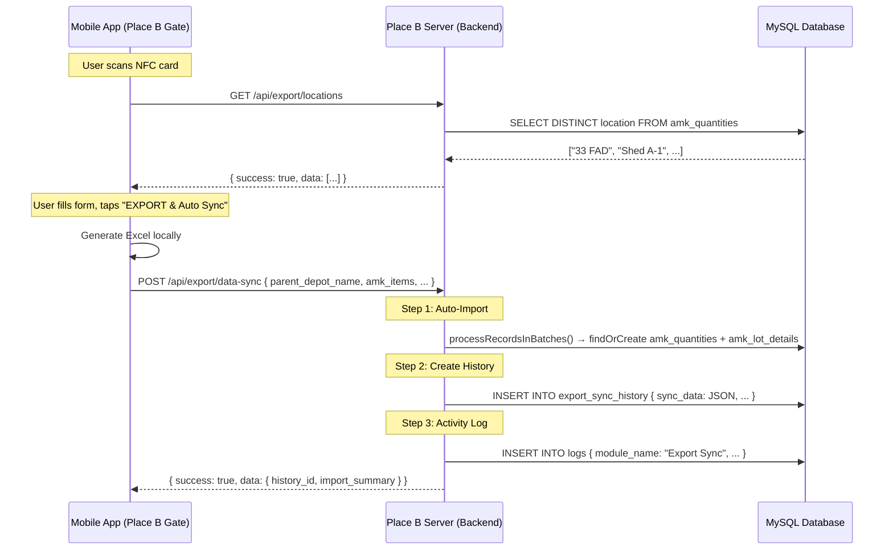

# Export Gate Flow — Entry Gate Automation & History Management

This plan covers two deliverables:

1. **Part 1 — Mobile App Handoff Document** for the Android developer and their AI agent
2. **Part 2 — Backend + Frontend Implementation Plan** for us to build the server-side APIs, auto-import, history module, and desktop UI

---

# PART 1: Mobile App Implementation Guide (For Android Dev + AI Agent)

> [!IMPORTANT]
> **For the Android developer / AI agent**: This document is your complete requirement spec. **Do NOT create, modify, or assume any backend API routes or server code.** The backend will be built on a separate branch by a different team. Treat the API contracts below as the source of truth. If an API doesn't exist yet, it will exist by the time you integrate — just code against the contracts.

---

## 1.1 Context & Business Flow

The DMS mobile app is used at Place B's entry gate. When an LTS (Load Tally Sheet) arrives from Place A via a vehicle/convoy, the entry gatekeeper:

1. Opens the app → taps **"EXPORT"** button on the home/login screen
2. Enters password → taps **"Proceed"**
3. Taps **"SCAN NFC CARD"** → scans the NFC card on the arriving vehicle
4. Sees a screen with vehicle/LTS/AMK data read from the NFC card
5. **NEW**: Fills in additional fields (parent depot name, new storage locations)
6. Taps **"EXPORT & Auto Sync"** → gets Excel download + server auto-sync + history log created

---

## 1.2 What Needs to Change in the Mobile App

### 1.2.1 New UI Elements — After NFC Card Scan

After the NFC card is scanned and the data is read from the card (the JSON payload), the current screen shows:

- Vehicle Number
- Driver Name
- Unit
- Checkout Time
- Scanned At timestamp

**Changes required on this screen:**

#### A) Top Section — New "Parent Depot Name" Input

Add a **text input field** at the **top** of the screen, **above** the existing vehicle info box:

| Element           | Type          | Label               | Required           | Notes                                                                                               |
| ----------------- | ------------- | ------------------- | ------------------ | --------------------------------------------------------------------------------------------------- |
| Parent Depot Name | `TextInput` | "Parent Depot Name" | **Optional** | Plain text input (NOT a dropdown). This captures where the LTS came from (Place A). Free-form text. |

#### B) AMK Details Section — Replace Current Box

Replace the current simple info box with a **detailed AMK card list**. For each AMK item found in the NFC card's JSON payload, render a card/section showing:

| Field                          | Source                                                                                                              | Display                                                              |
| ------------------------------ | ------------------------------------------------------------------------------------------------------------------- | -------------------------------------------------------------------- |
| AMK Number                     | NFC JSON field (look for key like`amk_number` or `amk`)                                                         | Text label                                                           |
| Nomenclature                   | NFC JSON field (look for`nomenclature`)                                                                           | Text label                                                           |
| Location (from Place A)        | NFC JSON field (look for`loc`, `shed_location`, or `shed_loc` — use regex/fallback to find whichever exists) | Text label — this is the**old** storage location from Place A |
| Given Quantity                 | NFC JSON field (look for`qty_bal`, `lot_quantity`, or `given_quantity`)                                       | Text label                                                           |
| **New Storage Location** | **New dropdown + custom add**                                                                                 | **See section C below**                                        |

> [!TIP]
> **How to find the location field in NFC JSON**: The field name is inconsistent across deployments. Use this fallback chain: look for `loc` first, then `shed_location`, then `shed_loc`. Whichever exists and is non-empty, use that as the "from" location. Use a regex or conditional check pattern like:
>
> ```
> val fromLocation = json.optString("loc") 
>     ?: json.optString("shed_location") 
>     ?: json.optString("shed_loc") 
>     ?: ""
> ```

#### C) New Storage Location Dropdown (Per AMK Item)

Each AMK item card needs a **dropdown** for selecting where this AMK lot will be stored at Place B:

- **Type**: Searchable dropdown / autocomplete select
- **Data source**: Call `GET /api/export/locations` (see API contract 1.4.1 below) to get the list of all existing locations
- **Custom "Add Location" option**: At the **bottom** of the dropdown list, add a button labeled **"+ Add Location"**
  - When tapped, show a **small modal/dialog** with:
    - Title: "Add New Location"
    - Input field: "Location Name"
    - Buttons: "Save" (adds the location to the local dropdown list and selects it) and "Cancel"
  - This new location is **local only** — it does NOT call any API to save it. It just gets added to the dropdown options for this session and gets sent to the server during sync.
- **Default**: Empty / unselected

#### D) Updated Buttons

| Old Button        | New Button                     | Behavior                             |
| ----------------- | ------------------------------ | ------------------------------------ |
| "EXPORT SELECTED" | **"EXPORT & Auto Sync"** | Exports Excel + syncs data to server |

---

### 1.2.2 Confirmation Modal Logic

When the user taps **"EXPORT & Auto Sync"**, before executing, run these validation checks:

**Check 1**: Is the "Parent Depot Name" field empty?
**Check 2**: Are any of the "New Storage Location" dropdowns empty (i.e., user didn't select a location for one or more AMK items)?
**Check 3**: Did the user add any **custom** locations (locations typed in via the "+ Add Location" modal that are NOT from the API dropdown)?

**If Check 1 OR Check 2 is true**, show a **warning confirmation modal**:

```
┌─────────────────────────────────────────────┐
│  ⚠️ Missing Information                   [X] │
│                                               │
│  The following fields are not filled:         │
│                                               │
│  • Parent Depot Name: Not provided            │
│  • AMK 1234 — New Location: Not selected      │
│  • AMK 5678 — New Location: Not selected      │
│                                               │
│  (If applicable):                             │
│  ⚡ You have added custom location(s):        │
│    - "Shed Z-14" (custom)                     │
│                                               │
│  Do you want to continue anyway?              │
│                                               │
│       [ Cancel ]        [ Continue ]          │
└───────────────────────────────────────────────┘
```

- **"Cancel"**: Dismiss modal, go back to the form. User can edit.
- **"Continue"**: Proceed with export + sync.
- **[X] close button**: Same as Cancel.
- **Android Back button**: Dismiss modal (same as Cancel). Do **NOT** close the app or lose progress.

**If Check 3 is true but Check 1 and Check 2 are false** (everything filled, but custom locations used), still show the modal but as an informational notice about the custom locations, with Continue and Cancel.

**If all fields are filled and no custom locations**, skip the modal and proceed directly.

---

### 1.2.3 Export Excel Changes

The existing export functionality generates an Excel file. In that Excel:

- There is a column for the storage location. The column header is **inconsistent** across deployments — it could be `loc`, `shed_location`, or `shed_loc`.
- **Change required**: Before writing the Excel, find the location column using regex/fallback (match any of `loc`, `shed_location`, `shed_loc`, `location`), and **replace** the old Place A location value with the **newly selected** storage location from the dropdown.
- If the user didn't select a new location for an AMK item, keep the old value.

---

### 1.2.4 Auto Sync — API Call After Export

After generating the Excel file, immediately make an API call to sync the data with the Place B server:

**Endpoint**: `POST /api/export/data-sync` (see API contract 1.4.2 below)

**When to call**: Right after the Excel is generated and saved. This should happen automatically — the user should not need to do anything extra.

**On success**: Show a success toast/snackbar: "Data synced successfully"
**On failure**: Show an error toast: "Sync failed. Please try again." — but still keep the exported Excel file.

---

## 1.3 UI/UX Design Guidelines

- Match the existing app's design language, colors, and typography
- The AMK detail cards should be visually distinct — use cards with slight elevation/shadow
- The dropdown should support search/filter typing
- The "Parent Depot Name" input should be prominent at the top
- The confirmation modal should look like a standard Material Design dialog
- The "+ Add Location" button in the dropdown should be visually distinct (perhaps a different color or icon)

---

## 1.4 API Contracts (What the Backend Will Provide)

> [!IMPORTANT]
> These APIs will be available on the Place B server (same LAN server the app connects to). **Do NOT create these routes in the backend.** They will be built by the backend team on a separate branch.

### 1.4.1 GET `/api/export/locations`

**Purpose**: Returns all unique storage locations known to the system (from AMK inventory data).

**Auth**: `Authorization: Bearer <token>` (same auth token pattern as all other APIs)

**Response** (200 OK):

```json
{
  "success": true,
  "data": [
    "33 FAD",
    "Shed A-1",
    "Shed B-2",
    "Main Store",
    "Cold Storage 1"
  ],
  "message": "Locations fetched successfully"
}
```

- Returns a flat array of **unique location strings**, sorted alphabetically.
- These come from the `amk_quantities.location` column in the database.

**Error Response** (500):

```json
{
  "success": false,
  "message": "Internal Server Error"
}
```

---

### 1.4.2 POST `/api/export/data-sync`

**Purpose**: Syncs the NFC card data to the server. This does two things atomically:

1. Auto-imports the AMK data into the server's inventory (same as if someone uploaded an Excel)
2. Creates a history log entry for this incoming shipment

**Auth**: `Authorization: Bearer <token>`

**Request Body**:

```json
{
  "parent_depot_name": "Place A Depot Name",
  "vehicle_number": "BA-1234",
  "driver_name": "John Doe",
  "unit": "33 FAD",
  "checkout_time": "2026-09-02T10:30:00.000Z",
  "scanned_at": "2026-09-02T11:45:00.000Z",
  "lts_name": "LTS-2026-001",
  "formation_name": "5th Brigade",
  "amk_items": [
    {
      "amk_number": "AMK-1234",
      "nomenclature": "5.56mm Ball Ammo",
      "old_location": "Shed X-5",
      "new_location": "Shed A-1",
      "is_custom_location": false,
      "given_quantity": 500,
      "lots": [
        {
          "lot_number": "230615/ABC",
          "lot_quantity": 250,
          "condition": "SER",
          "pkg_type": "Box"
        },
        {
          "lot_number": "230620/DEF",
          "lot_quantity": 250,
          "condition": "SER",
          "pkg_type": "Box"
        }
      ]
    },
    {
      "amk_number": "AMK-5678",
      "nomenclature": "7.62mm Tracer",
      "old_location": "Shed Y-3",
      "new_location": "Cold Storage 1",
      "is_custom_location": false,
      "given_quantity": 200,
      "lots": [
        {
          "lot_number": "231001/GHI",
          "lot_quantity": 200,
          "condition": "SER",
          "pkg_type": "Crate"
        }
      ]
    }
  ],
  "raw_nfc_json": { }
}
```

**Field Details**:

| Field                               | Type            | Required | Description                                                                                    |
| ----------------------------------- | --------------- | -------- | ---------------------------------------------------------------------------------------------- |
| `parent_depot_name`               | string          | No       | Free text. The place where this LTS came from (Place A). Can be empty.                         |
| `vehicle_number`                  | string          | Yes      | Vehicle BA number from NFC card                                                                |
| `driver_name`                     | string          | Yes      | Driver name from NFC card                                                                      |
| `unit`                            | string          | No       | Unit/formation string from NFC card                                                            |
| `checkout_time`                   | ISO 8601 string | No       | When the vehicle checked out from Place A                                                      |
| `scanned_at`                      | ISO 8601 string | Yes      | When the NFC card was scanned at Place B gate                                                  |
| `lts_name`                        | string          | No       | LTS name/number from NFC card if available                                                     |
| `formation_name`                  | string          | No       | Formation name from NFC card if available                                                      |
| `amk_items`                       | array           | Yes      | Array of AMK item objects (see sub-table)                                                      |
| `amk_items[].amk_number`          | string          | Yes      | AMK part number                                                                                |
| `amk_items[].nomenclature`        | string          | No       | Description of the ammunition                                                                  |
| `amk_items[].old_location`        | string          | No       | Previous location from Place A (from NFC JSON)                                                 |
| `amk_items[].new_location`        | string          | No       | New storage location at Place B (from dropdown or custom)                                      |
| `amk_items[].is_custom_location`  | boolean         | Yes      | `true` if user added this location via "+ Add Location", `false` if selected from dropdown |
| `amk_items[].given_quantity`      | number          | No       | Total quantity for this AMK item                                                               |
| `amk_items[].lots`                | array           | No       | Array of lot-level details                                                                     |
| `amk_items[].lots[].lot_number`   | string          | No       | Lot/batch number                                                                               |
| `amk_items[].lots[].lot_quantity` | number          | No       | Quantity in this lot                                                                           |
| `amk_items[].lots[].condition`    | string          | No       | Condition code:`SER`, `UNSE`, `RMJ`, `SEG`                                             |
| `amk_items[].lots[].pkg_type`     | string          | No       | Package type                                                                                   |
| `raw_nfc_json`                    | object          | No       | The complete raw JSON from the NFC card, sent as-is for archival                               |

**Response** (200 OK):

```json
{
  "success": true,
  "data": {
    "history_id": 42,
    "import_summary": {
      "total_amk_items": 2,
      "total_lots_imported": 3,
      "new_locations_created": 0
    }
  },
  "message": "Data synced and imported successfully"
}
```

**Error Response** (400):

```json
{
  "success": false,
  "message": "amk_items array is required and must not be empty"
}
```

---

### 1.4.3 NFC Card JSON — What to Extract

The NFC card carries a JSON payload written by the mobile app during the loading/gate flow at Place A. Your AI agent should find where the NFC card is read in the existing codebase and identify the JSON structure.

Key fields to extract from the NFC JSON (field names may vary — search the NFC read/write code):

| What you need  | Likely field name(s) in JSON                                                                                                                                   | Maps to                                |
| -------------- | -------------------------------------------------------------------------------------------------------------------------------------------------------------- | -------------------------------------- |
| Vehicle number | `vehicle_number`, `vehicle_number_ba_number`                                                                                                               | `vehicle_number` in sync payload     |
| Driver name    | `driver_name`                                                                                                                                                | `driver_name` in sync payload        |
| Unit           | `unit`                                                                                                                                                       | `unit` in sync payload               |
| Checkout time  | `end`, `checkout_time`                                                                                                                                     | `checkout_time` in sync payload      |
| LTS name       | `lts_name`, `name`                                                                                                                                         | `lts_name` in sync payload           |
| Formation name | `formation_name`                                                                                                                                             | `formation_name` in sync payload     |
| AMK items      | Look for arrays of items with`amk_number`/`amk`, `nomenclature`, `loc`/`shed_location`/`shed_loc`, `qty_bal`/`lot_quantity`/`given_quantity` | `amk_items[]` in sync payload        |
| Lot details    | Look for nested arrays with`lot_number`/`crity_lot`, `lot_quantity`/`qty_bal`, `condition`, `pkg_type`                                             | `amk_items[].lots[]` in sync payload |

> [!TIP]
> Search the codebase for NFC write operations to understand the exact JSON structure. The NFC tag write happens during the gate user flow — look for NFC tag write utility/helper functions.

---

## 1.5 Assumptions & Constraints for Mobile Dev

1. ✅ The Place B server is on the same LAN — no internet required
2. ✅ Auth tokens work the same way — the Export flow already handles authentication
3. ❌ **Do NOT modify any backend code** — the backend team will create the new routes
4. ❌ **Do NOT create new database tables or models** from mobile
5. ✅ The Excel export format stays the same, you're only changing the location column values
6. ✅ The NFC card read flow already exists — you're adding UI on top of the existing data
7. ✅ The "+ Add Location" via modal is **local only** during the session — the server will persist it if it's new during sync
8. ✅ Keep existing EXPORT button login flow exactly as-is — only rename the final export button to "EXPORT & Auto Sync"

---

---

# PART 2: Backend + Frontend Implementation Plan (Our Work)

---

## 2.1 Overview

We need to build:

1. **New API route**: `GET /api/export/locations` — returns unique locations list
2. **New API route**: `POST /api/export/data-sync` — receives NFC data, auto-imports AMK inventory, creates history log
3. **New DB table**: `export_sync_history` — stores the history of each sync event
4. **New backend module**: Export sync controller + service + model
5. **New frontend module**: Export Sync History viewer (similar to Activity Logs module)

---

## 2.2 User Review Required

> [!IMPORTANT]
> **Decision: New table `export_sync_history`** — This table stores each sync event as a JSON blob + key indexed fields. The history viewer in the frontend will render this similarly to the Activity Logs module. Is this approach acceptable, or do you want a more normalized structure?

> [!WARNING]
> **The import logic will reuse `processRecordsInBatches`** from [`excelTojson.js`](file:///home/prince/code/office/projects/dms/backend/helpers/excelTojson.js). The incoming mobile data needs to be transformed to match the same format (`amk`, `loc`, `crity_lot`, `qty_bal`, `condition`, `pkg_type`, `amn_shelf_life`). This means the auto-import will behave identically to uploading an Excel file — findOrCreate AMK records and add/update lots.

---

## 2.3 Open Questions

> [!IMPORTANT]
> 1. **Should the sync API require auth?** The Export button flow has its own auth (password + NFC). Should the `/api/export/data-sync` route also require a JWT token via `verifyAccessToken` middleware? (I'm assuming **yes** for consistency.)

> [!IMPORTANT]
> 2. **Should new custom locations from mobile be auto-created in `amk_quantities`?** When a user adds a custom location via "+ Add Location" in the mobile app and syncs, should we create a new `amk_quantities` record with that location, or just store it in history? (I'm assuming **yes** — create the AMK record with the new location, since that's what the import flow already does.)

> [!IMPORTANT]
> 3. **`amn_shelf_life` field**: The NFC card JSON may not carry this field. Should we default to empty/null during auto-import, or is this field available somewhere in the NFC data? (I'm assuming **null default**.)

---

## 2.4 Proposed Changes

### Backend — New Export Sync Module

---

#### [NEW] `backend/models/exportsynchistory.js`

New Sequelize model for the `export_sync_history` table:

```javascript
// Fields:
{
  id:                 INTEGER, PK, auto-increment
  parent_depot_name:  STRING(200), nullable     // "Where did this LTS come from"
  vehicle_number:     STRING(100), nullable     // Vehicle BA number
  driver_name:        STRING(200), nullable     // Driver name
  unit:               STRING(200), nullable     // Unit/formation text
  checkout_time:      DATE, nullable            // When vehicle left Place A
  scanned_at:         DATE, nullable            // When NFC was scanned at Place B
  lts_name:           STRING(200), nullable     // LTS voucher name
  formation_name:     STRING(200), nullable     // Formation name
  sync_data:          JSON, not null            // Full structured payload (the entire request body)
  import_summary:     JSON, nullable            // Result of the auto-import { total_amk_items, total_lots_imported, new_locations_created }
  synced_by:          INTEGER, nullable, FK→users.id  // Which user performed the sync
  // Timestamps: created_at, updated_at, deleted_at (paranoid soft delete)
}
```

**Key design**: `sync_data` stores the entire request JSON (including `amk_items`, `raw_nfc_json`) as unstructured JSON. The top-level indexed fields (`vehicle_number`, `driver_name`, `parent_depot_name`, etc.) are extracted for search/filter/display. This follows the same pattern as the `logs` table where `parameters` is stored as JSON.

---

#### [NEW] `backend/migrations/YYYYMMDDHHMMSS-create-export-sync-history.js`

Standard Sequelize migration creating the `export_sync_history` table with all fields above.

---

#### [NEW] `backend/controllers/exportSyncController.js`

Two exported functions:

**`getLocations(req, res)`**

- Queries `ManageAmkQuantity.findAll` for distinct non-null `location` values
- Returns sorted unique array of location strings
- Reuses the existing pattern from [`amkQuantityControllers.js` L556-L588](file:///home/prince/code/office/projects/dms/backend/controllers/amkQuantityControllers.js#L556-L588) but simplified to return just unique strings

**`dataSync(req, res)`**

- Validates request body (must have `amk_items` array with at least 1 item)
- **Step 1 — Auto-Import**: Transforms `amk_items` into the format expected by `processRecordsInBatches()`:
  ```javascript
  // Transform each amk_item + lot into the format:
  // { amk, loc, crity_lot, qty_bal, condition, pkg_type, amn_shelf_life }
  ```

  Then calls `processRecordsInBatches(transformedData, excelFileRecord, db)` to do the actual import. This is the same function used by the Excel upload flow.- For the `excelFileRecord`, we'll create an `AmkExcelSheets` record with a synthetic filename like `"auto_sync_<timestamp>"` and `store_type: "export_sync"` to distinguish it from manual uploads.
- **Step 2 — Create History**: Creates an `ExportSyncHistory` record with:
  - Top-level fields extracted from the request body
  - `sync_data` = entire request body as JSON
  - `import_summary` = result summary from the import step
  - `synced_by` = `req.user.id` (from auth middleware)
- **Step 3 — Log**: Uses the existing logger middleware pattern to create an activity log entry with `module_name: "Export Sync"`.
- Both import and history are inside a single function call but use **separate internal functions** so they can be reused independently in the future.

---

#### [NEW] `backend/services/exportSyncService.js`

Two service functions:

**`getUniqueLocations()`**

```javascript
// Returns: ["33 FAD", "Shed A-1", ...] — sorted unique strings
const data = await ManageAmkQuantity.findAll({
  attributes: [[Sequelize.fn('DISTINCT', Sequelize.col('location')), 'location']],
  where: { location: { [Op.ne]: null }, /* not deleted */ },
  order: [['location', 'ASC']],
  raw: true,
});
return data.map(d => d.location).filter(Boolean);
```

**`syncAndImport(payload, userId)`**

- Transforms `payload.amk_items` into Excel-like rows
- Creates synthetic `AmkExcelSheets` record
- Calls `processRecordsInBatches` for import
- Creates `ExportSyncHistory` record
- Returns `{ history_id, import_summary }`

---

#### [NEW] `backend/routes/exportSyncRoutes.js`

```javascript
const router = require('express').Router();
const { verifyAccessToken } = require('../middleware/authMiddleware');
const exportSyncController = require('../controllers/exportSyncController');

router.get('/export/locations', verifyAccessToken, exportSyncController.getLocations);
router.post('/export/data-sync', verifyAccessToken, exportSyncController.dataSync);

module.exports = router;
```

---

#### [MODIFY] `backend/routes/` — main router registration

Register the new `exportSyncRoutes.js` in the main app/router file (wherever routes are mounted, e.g., `app.js` or `routes/index.js`).

---

#### [MODIFY] `backend/services/moduleNameResolver.js`

Add the new export sync routes to the module name resolver so activity logs correctly tag them as "Export Sync" module.

---

### Frontend — Export Sync History Module

---

#### [NEW] `frontend/src/exportSyncHistory/ExportSyncHistory.jsx`

Main component — modeled after the [Activity Logs module](file:///home/prince/code/office/projects/dms/frontend/src/activityLogs/ActivityLogs.jsx):

- State: `historyList`, `filterData` (vehicle_number, parent_depot_name, date range), `pagination`
- On mount: fetch history list from `GET /api/export/sync-history` (paginated)
- Renders: `<ExportSyncHistorySearch />` + `<ExportSyncHistoryTable />`

---

#### [NEW] `frontend/src/exportSyncHistory/ExportSyncHistorySearch.jsx`

Filter form with:

- Vehicle Number text input
- Parent Depot Name text input
- Date range picker
- Search / Clear / Refresh buttons

---

#### [NEW] `frontend/src/exportSyncHistory/ExportSyncHistoryTable.jsx`

Table displaying:

| Column         | Field                              |
| -------------- | ---------------------------------- |
| #              | index                              |
| Parent Depot   | `parent_depot_name`              |
| Vehicle Number | `vehicle_number`                 |
| Driver Name    | `driver_name`                    |
| LTS            | `lts_name`                       |
| AMK Items      | Count of`sync_data.amk_items`    |
| Scanned At     | `scanned_at` (formatted)         |
| Synced At      | `created_at` (formatted)         |
| Action         | View Details button → opens modal |

Pagination footer using the existing `PaginationFooter` component.

---

#### [NEW] `frontend/src/exportSyncHistory/ExportSyncHistoryModal.jsx`

Detail modal (Ant Design modal like the Activity Logs detail modal):

- Shows all top-level fields
- Shows a collapsible section for each AMK item with:
  - Old Location → New Location
  - Lot details table
  - Custom location flag
- Shows raw NFC JSON in a `<pre>` block (collapsible)

---

#### [NEW] `frontend/src/exportSyncHistory/export_sync_history_event.js`

API event functions:

- `getExportSyncHistory(api, filterData, page)` → `GET /api/export/sync-history`
- (This is a read-only module — no create/update from frontend)

---

#### [MODIFY] [routeConstants.js](file:///home/prince/code/office/projects/dms/frontend/src/routing/routeConstants.js)

Add: `EXPORT_SYNC_HISTORY: "/export-sync-history"`

---

#### [MODIFY] [route.js](file:///home/prince/code/office/projects/dms/frontend/src/routing/route.js)

Add the new protected route:

```jsx
<Route path={routeConstants.EXPORT_SYNC_HISTORY} element={<LayoutPage><ExportSyncHistory /></LayoutPage>} />
```

---

#### [MODIFY] Sidebar navigation

Add "Export Sync History" link to the sidebar, near or under the existing "Activity Logs" entry.

---

### Backend — History Listing API (for Frontend)

---

#### [MODIFY] `backend/controllers/exportSyncController.js`

Add a third function:

**`getSyncHistory(req, res)`**

- Paginated list with filters: `vehicle_number`, `parent_depot_name`, `from_date`, `to_date`
- Returns: `{ data: [...], totalRecords, totalPages, currentPage }`
- Follows same pattern as activity logs controller

---

#### [MODIFY] `backend/routes/exportSyncRoutes.js`

Add: `router.get('/export/sync-history', verifyAccessToken, exportSyncController.getSyncHistory);`

---

## 2.5 Data Flow Diagram



---

## 2.6 Verification Plan

### Automated Tests

```bash
# Run backend tests after implementation
cd /home/prince/code/office/projects/dms/backend
npm test

# Verify migration runs
npx sequelize-cli db:migrate

# Test the new APIs manually with curl
curl -H "Authorization: Bearer <token>" http://localhost:8080/api/export/locations
curl -X POST -H "Authorization: Bearer <token>" -H "Content-Type: application/json" \
  -d '{"amk_items":[{"amk_number":"TEST-001","new_location":"Test Shed","lots":[{"lot_number":"230615/ABC","lot_quantity":100,"condition":"SER","pkg_type":"Box"}]}]}' \
  http://localhost:8080/api/export/data-sync
```

### Manual Verification

1. Run migration → confirm `export_sync_history` table is created
2. Call `GET /api/export/locations` → confirm it returns unique location strings from existing AMK data
3. Call `POST /api/export/data-sync` with test data → confirm:
   - AMK quantities are created/updated in the DB
   - Lot details are created in `amk_lot_details`
   - History record exists in `export_sync_history`
   - Activity log entry exists in `logs` with module "Export Sync"
4. Open frontend → navigate to Export Sync History → confirm table renders
5. Click a row → confirm detail modal shows correct data
6. **End-to-end with mobile**: Have Android dev test scan + sync flow with backend running
